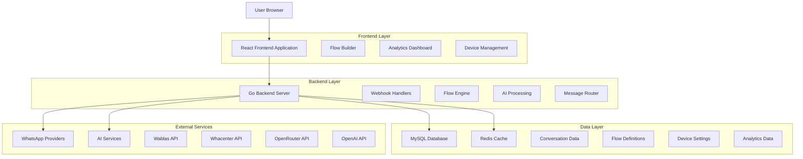
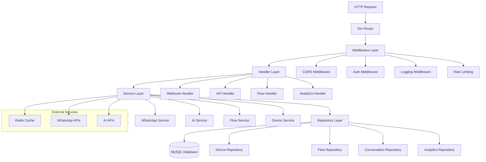
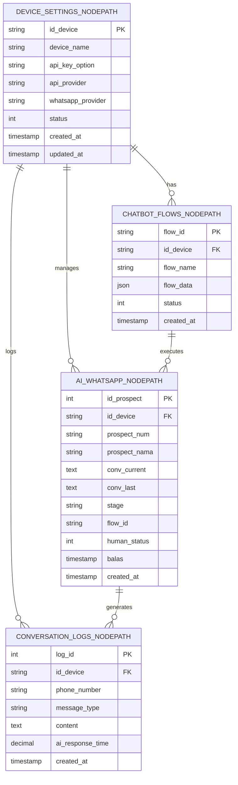

# NodePath Chat Technical Architecture Document

## 1. Architecture Design



## 2. Technology Description

- **Frontend**: React@18 + tailwindcss@3 + vite + typescript
- **Backend**: Go@1.21 + gin-gonic + gorm + redis
- **Database**: MySQL@5.7 (Railway hosted)
- **Cache**: Redis (session management)
- **Deployment**: Railway platform
- **External APIs**: OpenRouter, OpenAI, Wablas, Whacenter

## 3. Route Definitions

| Route | Purpose |
|-------|----------|
| / | Main dashboard and flow management interface |
| /login | User authentication page |
| /flows | Flow builder interface for creating conversation flows |
| /analytics | Analytics dashboard showing conversation metrics |
| /devices | Device management and configuration |
| /settings | System and user settings configuration |

## 4. API Definitions

### 4.1 Core API

#### WhatsApp Webhook Processing
```
POST /webhook/whatsapp
```

Request:
| Param Name | Param Type | isRequired | Description |
|------------|------------|------------|--------------|
| id_device | string | true | Device identifier |
| phone_number | string | true | WhatsApp phone number |
| message | string | true | Message content |
| message_type | string | true | Type of message (text, image, etc.) |
| timestamp | string | true | Message timestamp |

Response:
| Param Name | Param Type | Description |
|------------|------------|-------------|
| status | boolean | Processing status |
| message | string | Response message |

Example Request:
```json
{
  "id_device": "FakhriAidilTLW-001",
  "phone_number": "601137508067",
  "message": "Hello, I need help",
  "message_type": "text",
  "timestamp": "2024-01-15T10:30:00Z"
}
```

#### AI Response Generation
```
POST /api/ai/generate
```

Request:
| Param Name | Param Type | isRequired | Description |
|------------|------------|------------|--------------|
| id_device | string | true | Device identifier |
| flow_id | string | true | Flow identifier |
| current_text | string | true | Current user message |
| last_text | string | false | Previous bot response |
| stage | string | false | Current conversation stage |

Response:
| Param Name | Param Type | Description |
|------------|------------|-------------|
| stage | string | Updated conversation stage |
| response | array | Array of response parts |
| processing_time | float | AI processing time in seconds |

Example Response:
```json
{
  "stage": "Problem Identification",
  "response": [
    {
      "type": "text",
      "Jenis": "onemessage",
      "content": "I understand you need help. Can you tell me more about your issue?"
    }
  ],
  "processing_time": 1.23
}
```

#### Flow Management
```
GET /api/flows/{flow_id}
PUT /api/flows/{flow_id}
DELETE /api/flows/{flow_id}
```

#### Device Management
```
GET /api/devices
POST /api/devices
PUT /api/devices/{id_device}
```

#### Analytics Data
```
GET /api/analytics/conversations
GET /api/analytics/performance
GET /api/analytics/devices
```

### 4.2 TypeScript Type Definitions

```typescript
// Core Types
interface Device {
  id_device: string;
  device_name: string;
  api_key_option: string;
  api_provider: 'openrouter' | 'openai';
  whatsapp_provider: 'wablas' | 'whacenter';
  status: number;
  created_at: string;
  updated_at: string;
}

interface FlowNode {
  id: string;
  type: 'ai_prompt' | 'message' | 'image' | 'delay' | 'condition';
  data: Record<string, any>;
  next_node?: string;
  position: { x: number; y: number };
}

interface ChatbotFlow {
  flow_id: string;
  id_device: string;
  flow_name: string;
  flow_data: {
    nodes: FlowNode[];
    connections: Connection[];
  };
  status: number;
  created_at: string;
}

interface AIResponse {
  stage: string;
  response: ResponsePart[];
  processing_time?: number;
}

interface ResponsePart {
  type: 'text' | 'image';
  content: string;
  Jenis?: 'onemessage';
}

interface ConversationLog {
  log_id: number;
  id_device: string;
  phone_number: string;
  message_type: 'incoming' | 'outgoing';
  content: string;
  ai_response_time?: number;
  created_at: string;
}
```

## 5. Server Architecture Diagram



## 6. Data Model

### 6.1 Data Model Definition



### 6.2 Data Definition Language

#### Device Settings Table
```sql
-- Create device settings table
CREATE TABLE device_settings_nodepath (
    id_device VARCHAR(50) PRIMARY KEY,
    device_name VARCHAR(100) NOT NULL,
    api_key_option VARCHAR(100),
    api_provider VARCHAR(20) DEFAULT 'openrouter' CHECK (api_provider IN ('openrouter', 'openai')),
    whatsapp_provider VARCHAR(20) DEFAULT 'wablas' CHECK (whatsapp_provider IN ('wablas', 'whacenter')),
    status TINYINT DEFAULT 1,
    created_at TIMESTAMP DEFAULT CURRENT_TIMESTAMP,
    updated_at TIMESTAMP DEFAULT CURRENT_TIMESTAMP ON UPDATE CURRENT_TIMESTAMP
);

-- Create indexes
CREATE INDEX idx_device_settings_status ON device_settings_nodepath(status);
CREATE INDEX idx_device_settings_provider ON device_settings_nodepath(api_provider);

-- Insert initial data
INSERT INTO device_settings_nodepath (id_device, device_name, api_key_option, api_provider, whatsapp_provider) 
VALUES ('FakhriAidilTLW-001', 'Test Device', 'test_api_key', 'openrouter', 'wablas');
```

#### Chatbot Flows Table
```sql
-- Create chatbot flows table
CREATE TABLE chatbot_flows_nodepath (
    flow_id VARCHAR(50) PRIMARY KEY,
    id_device VARCHAR(50) NOT NULL,
    flow_name VARCHAR(100) NOT NULL,
    flow_data JSON NOT NULL,
    status TINYINT DEFAULT 1,
    created_at TIMESTAMP DEFAULT CURRENT_TIMESTAMP,
    FOREIGN KEY (id_device) REFERENCES device_settings_nodepath(id_device) ON DELETE CASCADE
);

-- Create indexes
CREATE INDEX idx_chatbot_flows_device ON chatbot_flows_nodepath(id_device);
CREATE INDEX idx_chatbot_flows_status ON chatbot_flows_nodepath(status);
CREATE INDEX idx_chatbot_flows_created ON chatbot_flows_nodepath(created_at DESC);

-- Insert initial flow
INSERT INTO chatbot_flows_nodepath (flow_id, id_device, flow_name, flow_data) 
VALUES (
    'flow_ai_1756016272', 
    'FakhriAidilTLW-001', 
    'AI Support Flow',
    JSON_OBJECT(
        'nodes', JSON_ARRAY(
            JSON_OBJECT(
                'id', 'start',
                'type', 'ai_prompt',
                'data', JSON_OBJECT(
                    'prompt', 'You are a helpful customer support agent. Assist users with their inquiries.',
                    'model', 'gpt-3.5-turbo'
                ),
                'next_node', 'end'
            )
        ),
        'connections', JSON_ARRAY()
    )
);
```

#### AI WhatsApp Conversations Table
```sql
-- Create AI WhatsApp conversations table
CREATE TABLE ai_whatsapp_nodepath (
    id_prospect INT AUTO_INCREMENT PRIMARY KEY,
    id_device VARCHAR(50) NOT NULL,
    prospect_num VARCHAR(20) NOT NULL,
    prospect_nama VARCHAR(100),
    conv_current TEXT,
    conv_last TEXT,
    stage VARCHAR(100),
    flow_id VARCHAR(50),
    human_status TINYINT DEFAULT 0,
    balas TIMESTAMP DEFAULT CURRENT_TIMESTAMP,
    created_at TIMESTAMP DEFAULT CURRENT_TIMESTAMP,
    FOREIGN KEY (id_device) REFERENCES device_settings_nodepath(id_device) ON DELETE CASCADE
);

-- Create indexes
CREATE INDEX idx_ai_whatsapp_device_phone ON ai_whatsapp_nodepath(id_device, prospect_num);
CREATE INDEX idx_ai_whatsapp_stage ON ai_whatsapp_nodepath(stage);
CREATE INDEX idx_ai_whatsapp_human_status ON ai_whatsapp_nodepath(human_status);
CREATE INDEX idx_ai_whatsapp_balas ON ai_whatsapp_nodepath(balas DESC);

-- Insert test conversation
INSERT INTO ai_whatsapp_nodepath (id_device, prospect_num, prospect_nama, stage, flow_id) 
VALUES ('FakhriAidilTLW-001', '601137508067', 'Test User', 'Problem Identification', 'flow_ai_1756016272');
```

#### Conversation Logs Table
```sql
-- Create conversation logs table
CREATE TABLE conversation_logs_nodepath (
    log_id INT AUTO_INCREMENT PRIMARY KEY,
    id_device VARCHAR(50) NOT NULL,
    phone_number VARCHAR(20) NOT NULL,
    message_type ENUM('incoming', 'outgoing', 'BOT_COMBINED') NOT NULL,
    content TEXT NOT NULL,
    ai_response_time DECIMAL(5,3),
    created_at TIMESTAMP DEFAULT CURRENT_TIMESTAMP,
    FOREIGN KEY (id_device) REFERENCES device_settings_nodepath(id_device) ON DELETE CASCADE
);

-- Create indexes
CREATE INDEX idx_conversation_logs_device_phone ON conversation_logs_nodepath(id_device, phone_number);
CREATE INDEX idx_conversation_logs_type ON conversation_logs_nodepath(message_type);
CREATE INDEX idx_conversation_logs_created ON conversation_logs_nodepath(created_at DESC);
CREATE INDEX idx_conversation_logs_response_time ON conversation_logs_nodepath(ai_response_time);

-- Insert sample log
INSERT INTO conversation_logs_nodepath (id_device, phone_number, message_type, content, ai_response_time) 
VALUES ('FakhriAidilTLW-001', '601137508067', 'incoming', 'Hello, I need help', NULL);
```

#### Performance Optimization Tables
```sql
-- Create analytics summary table for performance
CREATE TABLE analytics_summary_nodepath (
    summary_id INT AUTO_INCREMENT PRIMARY KEY,
    id_device VARCHAR(50) NOT NULL,
    date_period DATE NOT NULL,
    total_conversations INT DEFAULT 0,
    total_messages INT DEFAULT 0,
    avg_response_time DECIMAL(5,3),
    active_users INT DEFAULT 0,
    created_at TIMESTAMP DEFAULT CURRENT_TIMESTAMP,
    FOREIGN KEY (id_device) REFERENCES device_settings_nodepath(id_device) ON DELETE CASCADE,
    UNIQUE KEY unique_device_date (id_device, date_period)
);

-- Create indexes for analytics
CREATE INDEX idx_analytics_device_date ON analytics_summary_nodepath(id_device, date_period DESC);
CREATE INDEX idx_analytics_response_time ON analytics_summary_nodepath(avg_response_time);
```

#### Database Maintenance Procedures
```sql
-- Cleanup old conversation logs (older than 30 days)
DELETE FROM conversation_logs_nodepath 
WHERE created_at < DATE_SUB(NOW(), INTERVAL 30 DAY);

-- Update analytics summary daily
INSERT INTO analytics_summary_nodepath (id_device, date_period, total_conversations, total_messages, avg_response_time, active_users)
SELECT 
    id_device,
    CURDATE() as date_period,
    COUNT(DISTINCT phone_number) as total_conversations,
    COUNT(*) as total_messages,
    AVG(ai_response_time) as avg_response_time,
    COUNT(DISTINCT phone_number) as active_users
FROM conversation_logs_nodepath 
WHERE DATE(created_at) = CURDATE()
GROUP BY id_device
ON DUPLICATE KEY UPDATE
    total_conversations = VALUES(total_conversations),
    total_messages = VALUES(total_messages),
    avg_response_time = VALUES(avg_response_time),
    active_users = VALUES(active_users);
```

## 7. Performance Considerations

### Database Optimization
- **Connection Pooling**: Maximum 100 connections per instance
- **Query Optimization**: All queries use appropriate indexes
- **Partitioning**: Large tables partitioned by date
- **Caching**: Redis cache for frequently accessed data

### Scalability Features
- **Horizontal Scaling**: Stateless backend design
- **Load Balancing**: Multiple backend instances
- **Database Sharding**: Device-based data distribution
- **CDN Integration**: Static asset delivery

### Monitoring and Metrics
- **Response Time**: Target < 2 seconds for AI responses
- **Throughput**: 3000+ concurrent device connections
- **Error Rate**: < 1% for critical operations
- **Uptime**: 99.9% availability target

---

*Technical Architecture Document v1.0*
*Last Updated: January 2024*